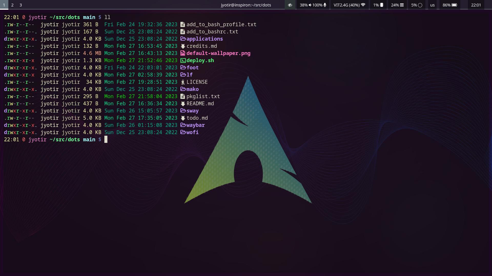
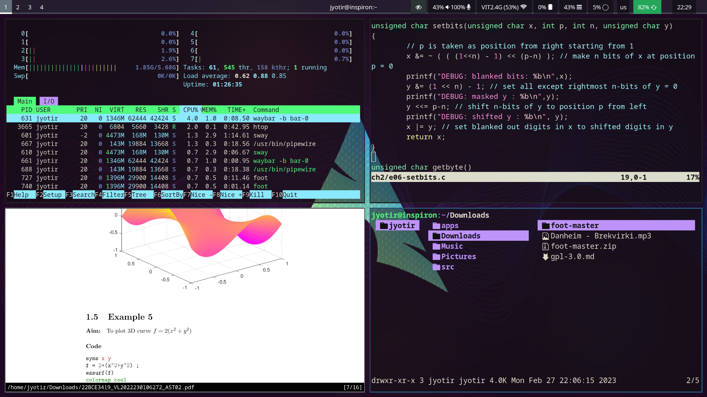

# Sway Dotfiles

## Screenshots




## Installation
1) Install base arch
2) Create user and grant superuser access using `sudo` or `doas`
3) Login as new user and run the following commands
```sh
doas pacman -S git
mkdir ~/src
cd ~/src
git clone https://github.com/jyotiradityatiwary/dots
cd dots
doas pacman -Syu - < pkglist.txt
./deploy.sh
```

## Updating
Run the following commands

```sh
cd ~/src/dots
git pull
./deploy.sh
```

## Help
See the [FAQ](docs/faq.md)
