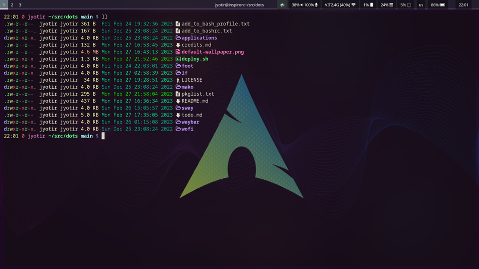

# Sway Dotfiles

## Screenshots




## Installation
1) Install base arch
2) Create user and grant superuser access using `sudo` or `doas`
3) Login as new user and run the following commands
```sh
doas pacman -S git
mkdir ~/src
cd ~/src
git clone https://github.com/jyotiradityatiwary/dots
cd dots
doas pacman -Syu - < pkglist.txt
./deploy.sh
```

## Updating
Run the following commands

```sh
cd ~/src/dots
git pull
./deploy.sh
```

## Help

See the [FAQ](docs/faq.md)

## Instructtions for extending script

- Do **not** use spaces or leading dots in the naming of files inside the `files` folder in this project as it will break the `for` loops in deploy.sh. For example, `files/home/.bashrc` and `files/home/my script.sh` are invalid file names.
- Script is written with usage inside arch linux in mind. This causes certain dependancies :
    - Package in pkglist.txt have names according to the arch linux official repos. This can be easily modified to work with other distributions by translating the package names.
    - Packages in pkglist.txt may not be present in official repos of other distributions. However scipt works if those packages are installed via any means, eg from alternate package managers, from source, etc.
    - There are certain dependancies like `NetworkManager`, `systemd-logind`, `polkit`, etc. So, making this script work (as intended and integrate properly) with non GNU/Linux operating systems will require major modifications.
